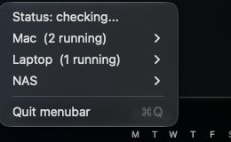

# hummin-menubar-macos

A native macOS menubar app for controlling a personal fleet of LLM servers
across multiple machines: local launchd services, Linux laptops over ssh
(systemd), and NAS docker compose stacks. One dropdown, three hosts, every
model start/stop/restart from one place.



Part of the [hummin](https://github.com/rennf93/hummin) family. MIT licensed,
zero dependencies, builds with the Swift toolchain alone.

## Features

- Nested host submenus (Mac, Laptop, NAS - or whatever you define), each row
  with Start / Stop / Restart and live state dots (running / stopped / in
  flight), with per-host running counts in the root menu
- Config-driven: servers live in a personal `servers.json`, not in code. Adding
  a model or a machine never means recompiling
- Mutex groups for servers that share a resource: starting one stops the
  others (e.g. several models, one small GPU)
- Optional mode switcher per server for anything driven by a mode file
  (included: a replay-trim proxy mode with instant `all / strip / off`
  switching)
- Non-blocking health checks: the menu renders instantly from a cache and
  refreshes in the background; checks run concurrently with a timeout, so an
  asleep laptop never stalls the menu
- Actions and health probes are logged to `~/Library/Logs/hummin-menubar-*.log`

## Build

```bash
swift build -c release
# binary at .build/release/HumminMenubar
# or: make build
```

## Configure

```bash
mkdir -p ~/.config/hummin-menubar
cp examples/servers.example.json ~/.config/hummin-menubar/servers.json
# edit: your hosts, your service names, your commands
```

Config search order: `$HUMMIN_MENUBAR_CONFIG`, then
`~/.config/hummin-menubar/servers.json`, then `./servers.json`.

| Field | Meaning |
|---|---|
| `hostOrder` | root menu order of the host groups |
| `servers[].id` | stable identifier (used in logs) |
| `servers[].label` | menu title |
| `servers[].host` | group name, must appear in `hostOrder` to be shown |
| `servers[].port` | optional, shown after the label; omit for non-network rows |
| `servers[].up` / `down` / `health` | shell commands; `health` exits 0 = running |
| `servers[].mutexGroup` | optional exclusivity group (start one, stop the rest) |
| `servers[].modes` / `modeGet` / `modeSet` | optional mode switcher; `{mode}` in `modeSet` is replaced |

## Run

```bash
.build/release/HumminMenubar
```

For always-on use, a LaunchAgent is the usual setup. Example plist (adjust
paths, then `launchctl bootstrap gui/501 <plist>`):

```xml
<?xml version="1.0" encoding="UTF-8"?>
<!DOCTYPE plist PUBLIC "-//Apple//DTD PLIST 1.0//EN" "http://www.apple.com/DTDs/PropertyList-1.0.dtd">
<plist version="1.0">
<dict>
    <key>Label</key><string>com.hummin.menubar</string>
    <key>ProgramArguments</key>
    <array>
        <string>/bin/zsh</string>
        <string>-lc</string>
        <string>exec $HOME/colibri/bin/hummin-menubar</string>
    </array>
    <key>RunAtLoad</key><true/>
    <key>KeepAlive</key><true/>
    <key>ProcessType</key><string>Interactive</string>
</dict>
</plist>
```

## Security notes

- `servers.json` contains shell commands that this app executes through your
  login shell. That is the entire point (it wraps ssh, launchctl, docker),
  and it means the file is trusted input: never install a config you have
  not read, and keep personal hostnames out of anything you publish.
- The app performs no network calls of its own. Every network action it can
  trigger is a command you wrote in your config.
- Health checks and actions run concurrently and bounded by timeouts, so an
  unreachable machine degrades to a gray dot, never to a hang.

## License

MIT. The bird is drawn pixel by pixel in code, so there are no assets.
